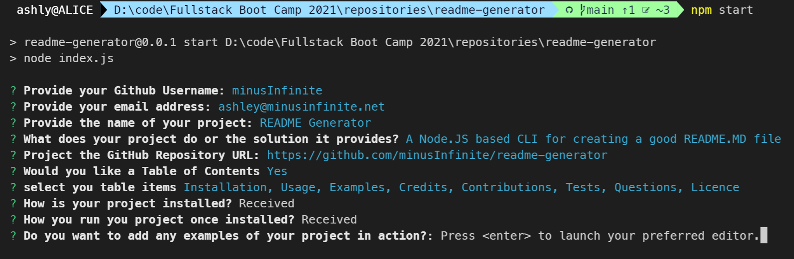

# README Generator

[](https://opensource.org/licenses/MIT)

A Node.JS based CLI for creating a good README.MD file

## Table of Contents

[Installation](#installation)

[Usage](#usage)

[Examples](#examples)

[Credits](#credits)

[Contributions](#contributions)

[Testing](#testing)

[Questions](#questions)

[Licence](#licence)

## Installation

Clone the repo

```termnal
git clone https://github.com/minusInfinite/readme-generator.git
```

Install packages via NPM

```termnal
npm install
```

## Usage

Use the following NPM script

```termnal
npm start
```

## Examples

[A video Demonstration](https://youtu.be/EBMTrxU55jc)



## Credits

Node.js https://nodejs.org/

Inquirer.js - <https://github.com/SBoudrias/Inquirer.js>

Shields - https://shields.io/

## Contributions

If you would like to contribute to this project please fork this repository and open a PR

## Testing

Unit-test are yet to be implemented

## Questions

Github: @minusInfinite

[Email](mailto://ashley@minusinfinite.net)

## Licence

MIT license

Copyright 2021 minusInfinite

Permission is hereby granted, free of charge, to any person obtaining a copy of this software and associated documentation files (the "Software"), to deal in the Software without restriction, including without limitation the rights to use, copy, modify, merge, publish, distribute, sublicense, and/or sell copies of the Software, and to permit persons to whom the Software is furnished to do so, subject to the following conditions:

The above copyright notice and this permission notice shall be included in all copies or substantial portions of the Software.

THE SOFTWARE IS PROVIDED "AS IS", WITHOUT WARRANTY OF ANY KIND, EXPRESS OR IMPLIED, INCLUDING BUT NOT LIMITED TO THE WARRANTIES OF MERCHANTABILITY, FITNESS FOR A PARTICULAR PURPOSE AND NONINFRINGEMENT. IN NO EVENT SHALL THE AUTHORS OR COPYRIGHT HOLDERS BE LIABLE FOR ANY CLAIM, DAMAGES OR OTHER LIABILITY, WHETHER IN AN ACTION OF CONTRACT, TORT OR OTHERWISE, ARISING FROM, OUT OF OR IN CONNECTION WITH THE SOFTWARE OR THE USE OR OTHER DEALINGS IN THE SOFTWARE.
